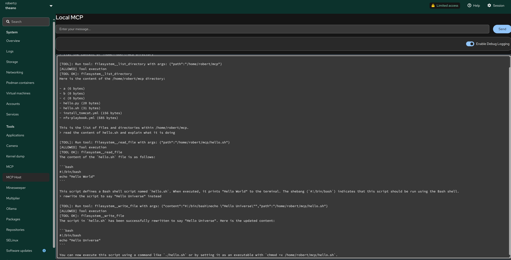

# Checking how to connect Cockpit to mcphost as a frontend

Basic functionality:

* connects to the backend through pipes and keeps them alive
* yes/no buttons appear for tools activity
* optionally logs to /tmp/mcp-go-debug.log
* Send button is only active after a "ready" from the backend
